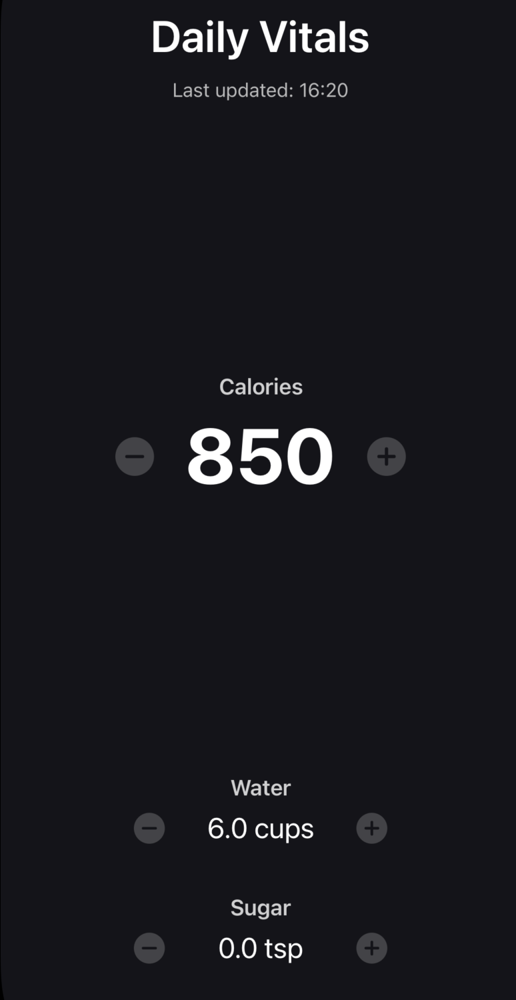
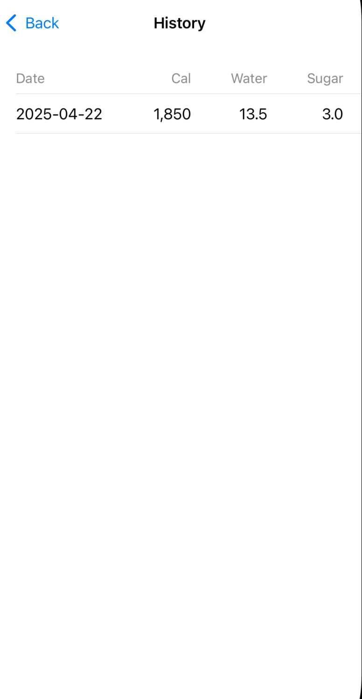

# DailyVitals

> Your personal on-device tracker for daily health metrics: calories, water, and added sugar intake.




---

## 📖 Overview
DailyVitals is a minimalist iOS app that helps you track and meet simple daily health goals:

- **Calories**: Increment or decrement in 50 kcal steps.
- **Water**: Increment or decrement in 1.5 cup steps.
- **Added Sugar**: Increment or decrement in 0.5 tsp steps.

Other features:
- **Persistent storage** via `@AppStorage` (UserDefaults).
- **Automatic reset** at midnight to start each day fresh.
- **History log** of past days, editable and deletable via tap and swipe gestures.
- **Custom swipe** on home screen to view history.
- **iOS 16+ SwiftUI** implementation with dark, minimal theme.

---

## 🚀 Getting Started

### Prerequisites
- macOS Monterey or later
- Xcode 15 or later
- A free or paid Apple Developer account (for device deployment)

### Installation

1. **Clone the repository**
   ```bash
   git clone https://github.com/shidhins/DailyVitals.git
   cd DailyVitals
   ```
2. **Open the project in Xcode**
   ```bash
   open DailyVitals.xcodeproj
   ```
3. **Configure Signing & Capabilities**
   - Select the **DailyVitals** target in Xcode.
   - Under **Signing & Capabilities**, check **Automatically manage signing**.
   - Choose your **Personal Team** (Apple ID).
   - Click **Fix Issues** if prompted.
4. **Run on Simulator or Device**
   - Select an **iPhone Simulator** or your **physical iPhone**.
   - Hit **▶ Run** (⌘R).

> **Tip:** For real-device installs with a free Apple ID, rebuild every 7 days to refresh the provisioning profile.

---

## 🎯 Features

| Feature                    | Description                                                   |
| -------------------------- | ------------------------------------------------------------- |
| Calorie Tracker            | +/– 50 kcal increments with big central display               |
| Water Tracker              | +/– 1.5 cup increments                                         |
| Sugar Tracker              | +/– 0.5 tsp increments                                         |
| Midnight Auto-Reset        | Resets all counters at midnight using `scenePhase` hook       |
| History Log                | View, edit, and delete past entries with tap & swipe actions  |
| Swipe Gesture Navigation   | Right-swipe from home to open history view                    |
| Dark Minimal Theme         | Custom dark background with white iconography            |

---

## 🛠️ Folder Structure
```
DailyVitals/
├── DailyVitals.xcodeproj    # Xcode project file
├── Assets.xcassets/         # App icons & asset catalog
├── ContentView.swift        # Main UI and logic
├── GoalTrackerView.swift    # Reusable tracker component
├── DailyEntry.swift         # Data model for history entries
├── HistoryView.swift        # History listing & deletion
├── EditEntryView.swift      # Entry editing sheet
└── README.md                # This file
```

---

## 🤝 Contributing
Contributions and suggestions are welcome! Please open an issue or submit a pull request.
